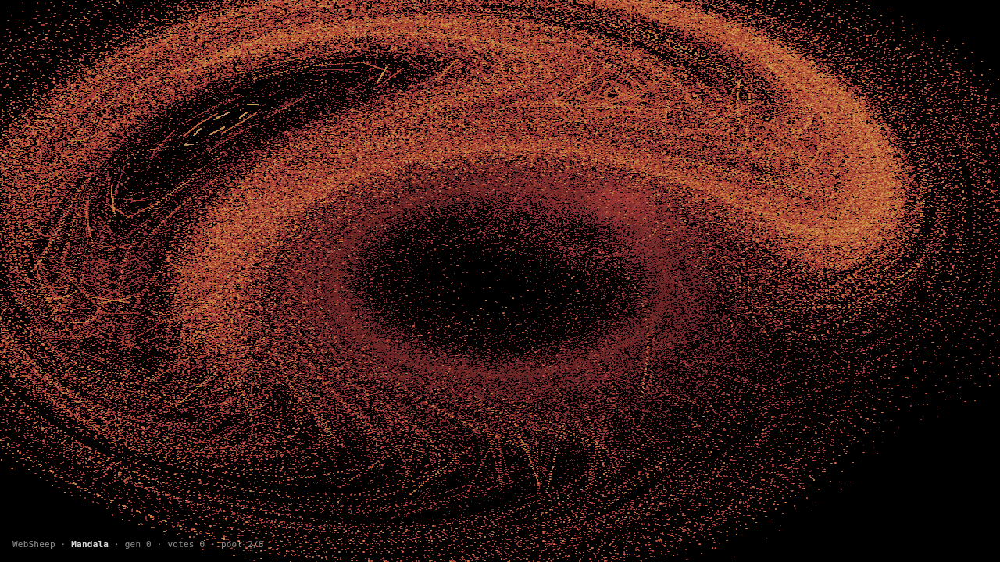

# WebSheep

A web-based fractal flame screensaver — Electric Sheep for the browser era.



Open it, full-screen it (`F`), and let it run. Sheep smoothly fade into each other when you cycle (`→`), and you can breed your own variants — mutate the current sheep (`M`) or crossover with a random one (`X`). Stare at it for a few minutes and the slow rotation animation cycles over a 4-minute loop.

This is the **MVP + Phase B polish**: fully client-side, no server, no build step. The renderer is WebGL2 (ping-pong accumulator + Monte Carlo fractal flames). Phase A would add a server so sheep breed globally based on votes.

## Running

```bash
python3 -m http.server 5173
# then open http://localhost:5173/
```

Any static HTTP server works. Must be served over HTTP (not `file://`) for ES module imports.

## Controls

| Key | Action |
|---|---|
| `F` | fullscreen |
| `→` / `Space` | next sheep (with 1.5s cross-fade) |
| `←` | previous sheep |
| `↑` / `↓` | vote up / down |
| `M` | mutate (spawn a child sheep) |
| `Shift+M` / `X` | crossover with a random other sheep |
| `P` | pause animation |
| `R` | reset accumulator (cancels in-flight cross-fade) |
| `?` | toggle help overlay |

## How breeding works

Each sheep has a genome (affine xforms, variation functions, palette, motion keyframes, gamma/vibrancy/brightness). The full spec is in [`ideas/websheep-spec.md`](ideas/websheep-spec.md) (lives in the author's vault; not in this repo).

**Mutation** (`M`): each of the 6 coefs per xform has a 5% chance to nudge by `gauss(σ=0.1)`. Variations have a 2% chance to swap to a different function. Palette has a 10% chance to fully replace with a random preset. Motion keyframes get smaller perturbations since they're sensitive.

**Crossover** (`X` / `Shift+M`): xforms are taken alternately from each parent. Palette stops are averaged position-by-position. Motion keyframes are averaged coefficient-by-coefficient.

**Selection (Phase A — not implemented)**: votes determine which sheep reproduce. Currently votes are recorded locally in `localStorage` but breeding is purely user-triggered — there is no autonomous loop, no background GA. Pressing `M`/`X` is the only way sheep get made.

## Architecture

- `index.html` — single self-contained page with inline GLSL shaders + JS
- `src/sheep-pool.js` — 8 hand-tuned starter sheep genomes
- `src/evolution.js` — client-side mutation + crossover operators

**Renderer:**
- WebGL2 fragment-shader Monte Carlo: each vertex of a 256×256 = 65,536-point grid runs 4 IFS iterations per frame
- 4 multi-passes per frame (one per stored iteration) — yields ~260k samples/frame
- Accumulator: 1024×1024 RGBA16F ping-pong float framebuffer
- Display: fullscreen quad samples accumulator, applies log-density → palette lookup → gamma
- Cross-fade: snapshot FBO captures the pre-switch accumulator; display shader blends live + snapshot per-pixel for 1.5s

**Motion:**
- 8 keyframes per sheep, each a rotated copy of the base xforms (`rotateKeyframes` in `sheep-pool.js`)
- 30s per keyframe segment → 4-minute loop
- Frame interpolation between consecutive keyframes is smooth

## Roadmap

| Phase | Status | What |
|---|---|---|
| **0 — MVP** | ✅ shipped | WebGL2 renderer, 8 starter sheep, local mutation + crossover, votes, keyboard controls |
| **B — Polish** | ✅ shipped | Cross-fade transitions, longer motion loops |
| **A — Server** | ⏳ next | Fastify/Bun + Postgres + Redis + SSE. Server-driven GA: tally votes, compute fitness, tournament selection, push new sheep every 60s |
| **C — Stretch** | ⏳ post-launch | Audio reactivity, WebGPU compute path, WebRTC P2P, mobile |

The full design (Phase 0–5, post-server) lives in the author's vault at `~/Obsidian/ideas/websheep-spec.md` and `~/Obsidian/ideas/websheep-rendering.md` — not mirrored here.

## Credits

Based on Scott Draves's **Electric Sheep** screensaver (1999) and the **fractal flame** algorithm. The Draves 2005 EvoMUSArt paper is the canonical reference for the GA loop.

Built as an evening project. No dependencies — just a static page and a static server.
